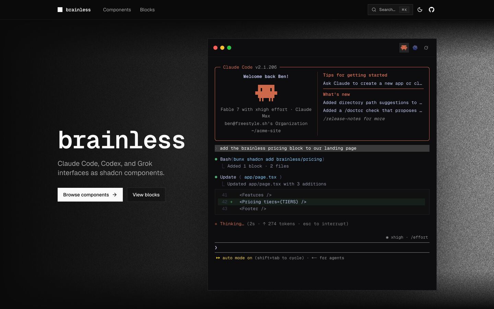
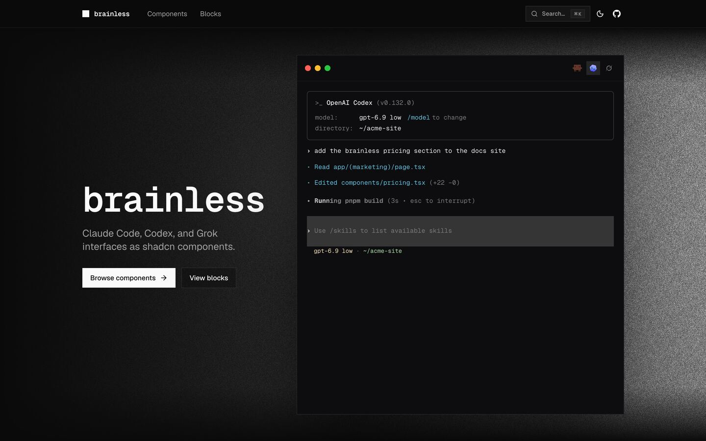
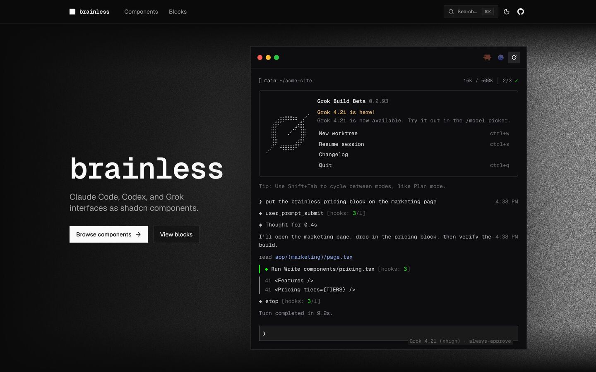
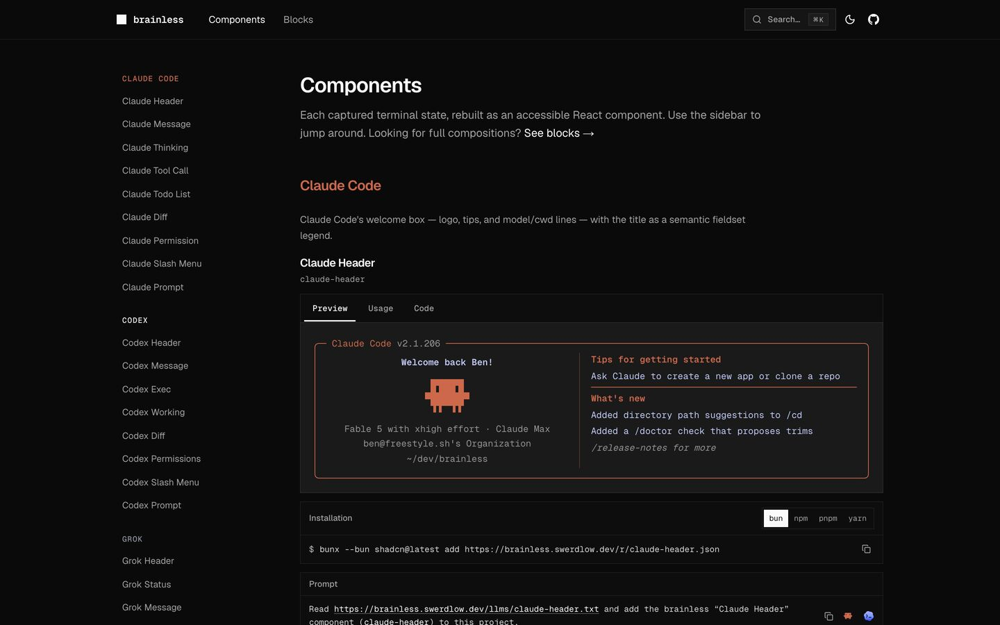
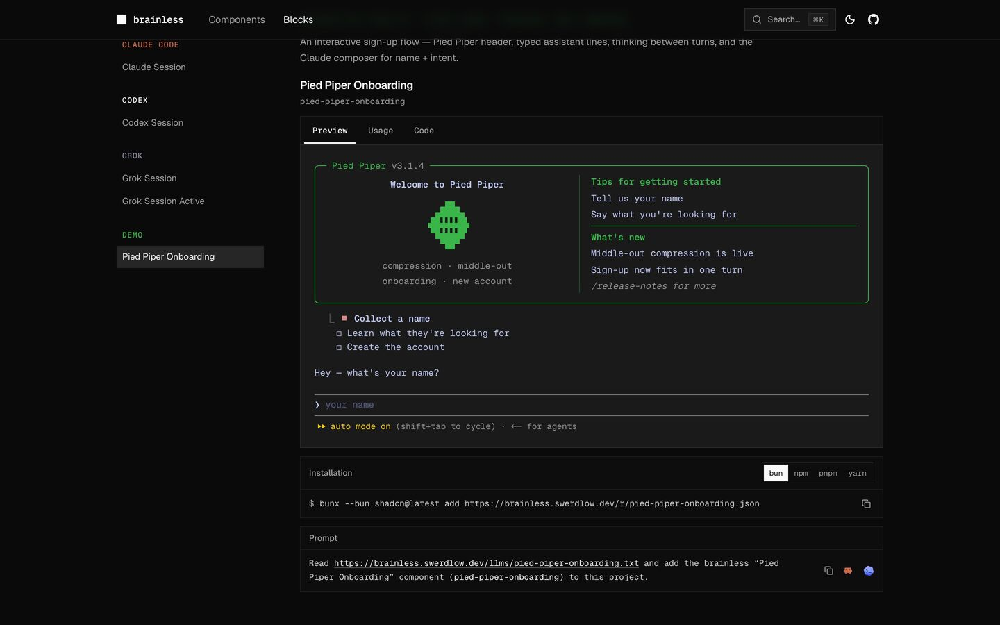

# brainless

Claude Code, Codex, and Grok interfaces as [shadcn](https://ui.shadcn.com) components.

**Site:** [brainless.swerdlow.dev](https://brainless.swerdlow.dev) · **Repo:** [github.com/theswerd/brainless](https://github.com/theswerd/brainless)

<p align="center">
  
</p>

<p align="center">
  
  
</p>

## What is this?

**brainless** is a shadcn/ui registry of accessible React components that recreate the terminal UIs of coding agents — Claude Code, OpenAI Codex, and Grok — so you can drop them into docs, demos, marketing pages, and product UI without screenshots or iframes.

Components are built for fidelity against real terminal captures, then shipped as copy-pasteable registry items.

## Install

### Namespace (recommended)

```bash
bunx shadcn@latest registry add @brainless=https://brainless.swerdlow.dev/r/{name}.json
bunx shadcn@latest add @brainless/claude-session
bunx shadcn@latest add @brainless/codex-session
bunx shadcn@latest add @brainless/grok-session
```

Or add the registry manually in `components.json`:

```json
{
  "registries": {
    "@brainless": "https://brainless.swerdlow.dev/r/{name}.json"
  }
}
```

### URL

```bash
bunx shadcn@latest add https://brainless.swerdlow.dev
bunx shadcn@latest add https://brainless.swerdlow.dev/r/claude-session.json
```

### GitHub

```bash
bunx shadcn@latest add theswerd/brainless/claude-session
```

Browse individual pieces on [components](https://brainless.swerdlow.dev/components) and [blocks](https://brainless.swerdlow.dev/blocks).

## Components

| Family | Pieces |
| --- | --- |
| **Claude** | header, message, thinking, tool call, diff, permission, prompt, slash menu, todo list |
| **Codex** | header, message, working, exec, diff, permissions, prompt, slash menu |
| **Grok** | status, header, message, thinking, thought, tool, write, turn end, prompt, slash menu, and more |
| **Blocks** | `claude-session`, `codex-session`, `grok-session`, `grok-session-active` |

<p align="center">
  
  
</p>

## Repo layout

```
registry/brainless/   # source components (claude / codex / grok / blocks / ui)
public/r/             # built registry JSON for shadcn add
references/captures/  # ANSI / HTML / text frames from real CLIs
tools/capture/        # tmux capture harness
app/                  # docs site (Next.js)
docs/screenshots/     # README screenshots
```

## Capture harness

Fidelity starts from real terminal output. The capture tools under `tools/capture/` drive agents in tmux, dump frames as ANSI / HTML / text, and land them in `references/captures/` for side-by-side review.

## Develop

```bash
bun install
bun run registry:build   # writes public/r/*.json
bun run dev
```

`bun run build` runs the registry build, then Next.js.

## License

MIT
